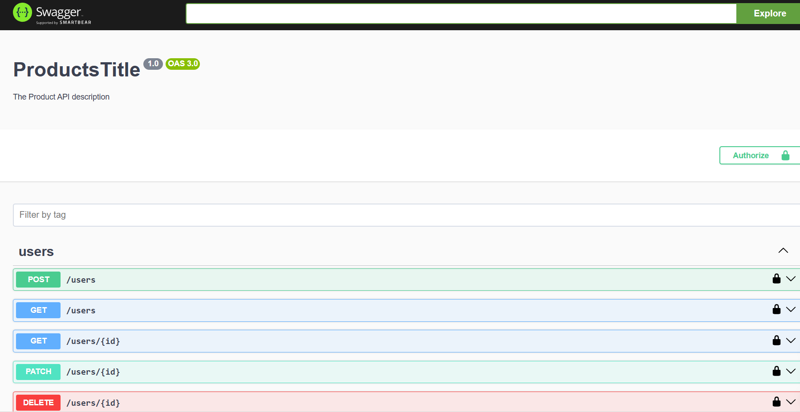

Este repo es una practica personal donde se integraron diferentes tecnologías para crear un sistema de gestión de organizaciones y usuarios.

sirve para practicar la integración de diferentes tecnologías y aprender a usarlas en un proyecto real. Diferentes Roles y permisos para un usuario ADMIN y MANAGER. Admin tenia acceso a todas las rutas y el MANAGER tenia acceso a las rutas que pertenecían a su organización. y Manager tenia acceso a los que tenian decorador de manager.
todo capturado de acuerdo a su atenticacion y login 




# paso 1


# paso 2


## Tecnologías usadas

- NestJS
- Prisma
- Swagger
- Passport
- JWT

## Pasos para ejecutar el proyecto


para swagger uso 
pnpm nest . new
pnpm add -D @nestjs/swagger swagger-ui-express

pnpm add -D prisma // agregar la dependencia de prisma
prisma init // para crear la base de datos schema

migro 
pnpm prisma migrate dev --name init 
carpeta de migrate

luego 
nest g resource prisma
-> genera carpeta prisma

nest g resource users
-> genera carpeta users


genero carpetas 
nest g controller auth
nest g module auth
nest g service auth

ahora ya jwt
pnpm add @nestjs/jwt @nestjs/passport passport passport-jwt

 @nestjs/jwt -> funcionalidades que necesitamos para el crear, firmar y verificar tokens
 @nestjs/passport -> integrar el moduilo principal de passport con nestjs
  Módulo de NestJS para integrar el middleware passport.
    Se encarga de integrar las estrategias de autenticación de Passport en el ecosistema NestJS.
      Provee decoradores y helpers como @UseGuards(AuthGuard('jwt')).

 passport -> modulo principal del middleware de pasaporte
 🔌 Middleware base para autenticación.
    Es la librería principal, sobre la cual se montan las estrategias (passport-jwt, passport-local, etc.).

    Manejá sesiones, estrategias, autenticación, etc.


 passport-jwt -> estragia de autenticacion 
. passport-jwt
    🔐 Estrategia específica de Passport para autenticación con JWT.

    Permite usar tokens JWT para autenticar usuarios.

    Se usa junto con passport y @nestjs/passport.


import {Strategy, ExtractJwt} from 'passport-jwt';
para usar el extractjwt
hacemos 
pnpm add @types/passport-jwt


carpeta decorators
con public.decorator.ts


hago orgazitation
nest g module organization
nest g controller organization
nest g service organization
una vez configuro todo

ahora instalo validator y transformer
pnpm add class-transformer class-validator


la parte sdk
instalo axios
pnpm add axios

<p align="center">
  <a href="http://nestjs.com/" target="blank"></a>
</p>

[circleci-image]: https://img.shields.io/circleci/build/github/nestjs/nest/master?token=abc123def456
[circleci-url]: https://circleci.com/gh/nestjs/nest

  <p align="center">A progressive <a href="http://nodejs.org" target="_blank">Node.js</a> framework for building efficient and scalable server-side applications.</p>
    <p align="center">
<a href="https://www.npmjs.com/~nestjscore" target="_blank"></a>
<a href="https://www.npmjs.com/~nestjscore" target="_blank"></a>
<a href="https://www.npmjs.com/~nestjscore" target="_blank"></a>
<a href="https://circleci.com/gh/nestjs/nest" target="_blank"></a>
<a href="https://discord.gg/G7Qnnhy" target="_blank"></a>
<a href="https://opencollective.com/nest#backer" target="_blank"></a>
<a href="https://opencollective.com/nest#sponsor" target="_blank"></a>
  <a href="https://paypal.me/kamilmysliwiec" target="_blank"></a>
    <a href="https://opencollective.com/nest#sponsor"  target="_blank"></a>
  <a href="https://twitter.com/nestframework" target="_blank"></a>
</p>
  <!--[](https://opencollective.com/nest#backer)
  [](https://opencollective.com/nest#sponsor)-->

## Description

[Nest](https://github.com/nestjs/nest) framework TypeScript starter repository.

## Project setup

```bash
$ pnpm install
```

## Compile and run the project

```bash
# development
$ pnpm run start

# watch mode
$ pnpm run start:dev

# production mode
$ pnpm run start:prod
```

## Run tests

```bash
# unit tests
$ pnpm run test

# e2e tests
$ pnpm run test:e2e

# test coverage
$ pnpm run test:cov
```

## Deployment

When you're ready to deploy your NestJS application to production, there are some key steps you can take to ensure it runs as efficiently as possible. Check out the [deployment documentation](https://docs.nestjs.com/deployment) for more information.

If you are looking for a cloud-based platform to deploy your NestJS application, check out [Mau](https://mau.nestjs.com), our official platform for deploying NestJS applications on AWS. Mau makes deployment straightforward and fast, requiring just a few simple steps:

```bash
$ pnpm install -g @nestjs/mau
$ mau deploy
```

With Mau, you can deploy your application in just a few clicks, allowing you to focus on building features rather than managing infrastructure.

## Resources

Check out a few resources that may come in handy when working with NestJS:

- Visit the [NestJS Documentation](https://docs.nestjs.com) to learn more about the framework.
- For questions and support, please visit our [Discord channel](https://discord.gg/G7Qnnhy).
- To dive deeper and get more hands-on experience, check out our official video [courses](https://courses.nestjs.com/).
- Deploy your application to AWS with the help of [NestJS Mau](https://mau.nestjs.com) in just a few clicks.
- Visualize your application graph and interact with the NestJS application in real-time using [NestJS Devtools](https://devtools.nestjs.com).
- Need help with your project (part-time to full-time)? Check out our official [enterprise support](https://enterprise.nestjs.com).
- To stay in the loop and get updates, follow us on [X](https://x.com/nestframework) and [LinkedIn](https://linkedin.com/company/nestjs).
- Looking for a job, or have a job to offer? Check out our official [Jobs board](https://jobs.nestjs.com).

## Support

Nest is an MIT-licensed open source project. It can grow thanks to the sponsors and support by the amazing backers. If you'd like to join them, please [read more here](https://docs.nestjs.com/support).

## Stay in touch

- Author - [Kamil Myśliwiec](https://twitter.com/kammysliwiec)
- Website - [https://nestjs.com](https://nestjs.com/)
- Twitter - [@nestframework](https://twitter.com/nestframework)

## License

Nest is [MIT licensed](https://github.com/nestjs/nest/blob/master/LICENSE).
